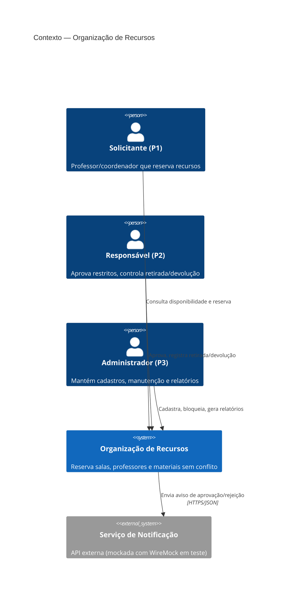
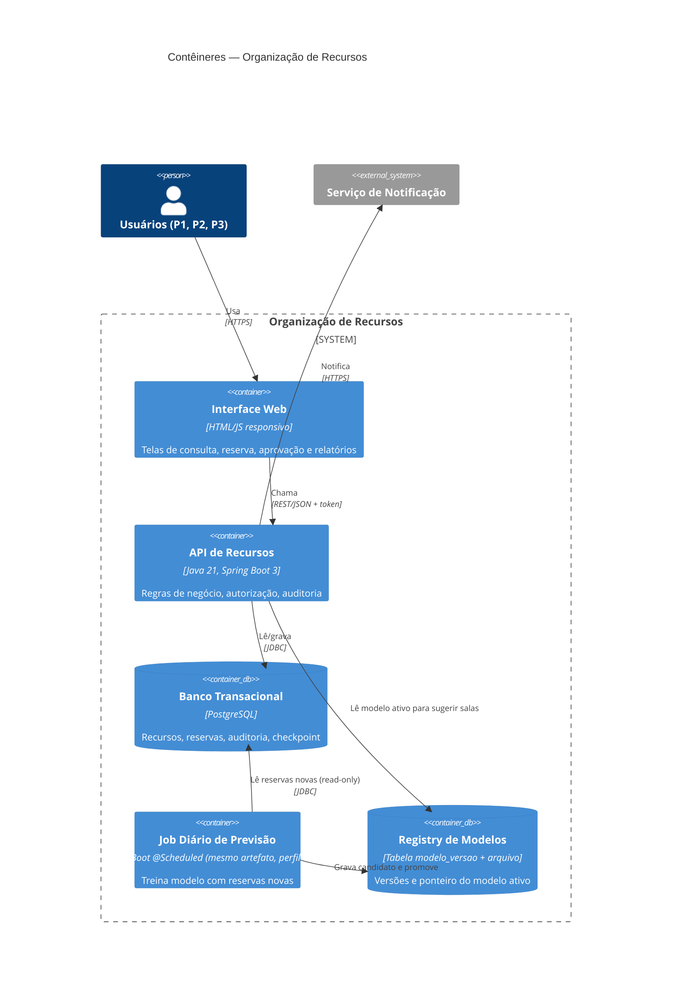
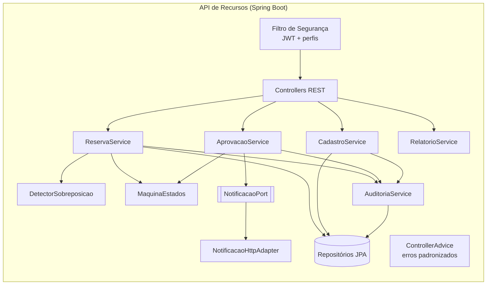
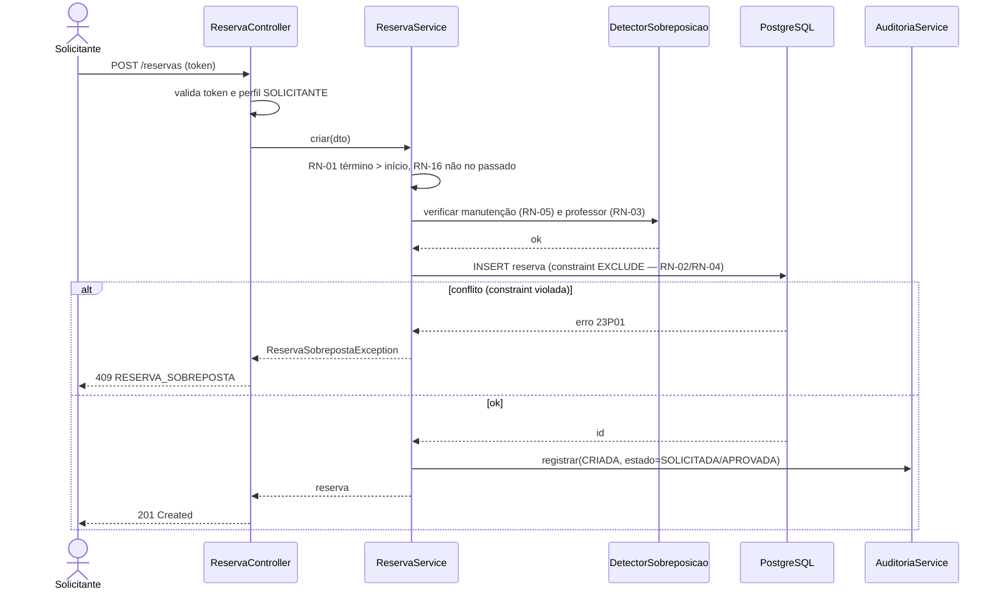
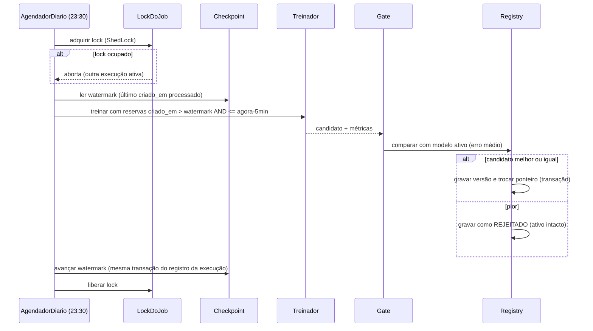

# Organização de Recursos — Arquitetura e Análise ATAM

> Entregável da Aula 04 (Semana 35). Fonte de verdade: `docs/prd.md` (personas, RF, RNF, RN) e a especificação do professor.
> Convenção: **[FATO]** está no PRD/especificação · **[SUPOSIÇÃO]** é hipótese da equipe · **[LACUNA]** não existe em lugar nenhum · **[DECISÃO]** é escolha com justificativa.

## 1. Contexto e objetivo

Alocar salas, professores e materiais **sem conflitos**, com auditoria e evidências de qualidade (PRD §1). Stack imposta pela especificação: **Java 21 · Spring Boot 3.x** [FATO].

## 2. Stakeholders / personas

| Persona | Perfil | Interesse arquitetural |
|---|---|---|
| P1 Marina | SOLICITANTE | Latência da consulta, confiabilidade da reserva, uso no celular |
| P2 Carlos | RESPONSAVEL | Autorização, auditoria, estados |
| P3 Juliana | ADMINISTRADOR | Segurança/LGPD, relatórios, manutenção |
| Professor/avaliador | — | Testabilidade, CI, rastreabilidade |

## 3. Fonte de verdade consultada

- `docs/prd.md`: RF-01 a RF-27, RNF-01 a RNF-20, RN-01 a RN-16.
- Especificação do projeto (site do professor).
- Restrição da Aula 04: **cron diário treina/retreina só com dados novos** → registrada como **"restrição fornecida pelo professor"** (RF-27). Ela não faz parte da especificação original do projeto. **[LACUNA]:** confirmar se é obrigatória no projeto de recursos.

## 4. Requisitos arquiteturalmente significativos (drivers)

| Driver | Origem | Por que é arquitetural |
|---|---|---|
| D1 Nenhuma dupla reserva, nem sob concorrência | RF-13, RN-04, RNF-03 | Depende de onde mora a garantia (banco × aplicação) |
| D2 Sem sobreposição de recurso **e** de professor | RF-12, RN-02, RN-03 | Modelo de dados da agenda |
| D3 Autorização por perfil | RF-02, RNF-04, RNF-05 | Camada transversal (Spring Security) |
| D4 Auditoria imutável | RF-20, RN-09, RNF-10 | Padrão de gravação append-only |
| D5 Integração externa isolável em teste | RF-21 | Porta/adaptador + WireMock |
| D6 Job diário incremental sem afetar o online | RF-27, RNF-17, RNF-18 | Novo contêiner, watermark, registry |
| D7 Testabilidade (80/70, Sonar) | RNF-11, RNF-12 | Camadas desacopladas |

## 5. Fatos, lacunas, suposições e perguntas

- **S-01 [SUPOSIÇÃO]:** até **50 usuários simultâneos** no pico. Se forem 500, rever o pool de conexões e o cache (afeta ADR-002).
- **S-02 [SUPOSIÇÃO]:** até ~100 mil reservas/semestre. Se for muito maior, os relatórios vão precisar de uma réplica.
- **S-03 [SUPOSIÇÃO]:** o "modelo de previsão" é simples (média móvel/regressão por recurso × dia × hora). Ele serve para cumprir a restrição, não para ser ciência de dados.
- **L-01 [LACUNA]:** a interface web é obrigatória ou basta a API + Swagger?
- **L-02 [LACUNA]:** o horário de funcionamento da instituição (necessário para a taxa de utilização, RF-22).
- **P-01 [PERGUNTA]:** uma reserva agrupa sala + materiais ou cada recurso tem a sua reserva?

## 6. C4 — Nível 1: Contexto

## 7. C4 — Nível 2: Contêineres

## 8. C4 — Nível 3: Componentes da API

**Componentes do job diário (nível 3):** `AgendadorDiario` → `LockDoJob` → `SeletorIncremental` (watermark) → `ValidadorDados` → `Treinador` → `AvaliadorCandidato` (gate) → `Promotor` (troca de ponteiro) → `AtualizadorCheckpoint`.

## 9. Sequência — fluxo online (criar reserva)

## 10. Sequência — job diário

## 11. Pipeline batch — controles

| Controle | Como fazemos | Se faltar |
|---|---|---|
| Watermark/checkpoint | Tabela `job_checkpoint(ultimo_criado_em)` | Reprocessa tudo ou perde dados |
| Atualização atômica | Watermark avança **na mesma transação** que registra a execução bem-sucedida | Dados do intervalo somem |
| Idempotência | Treino identificado por `(inicio, fim)` do intervalo; reexecução substitui o candidato | Duplicação |
| Deduplicação | Seleção por `id` distinto | Peso errado no treino |
| Lock | ShedLock (tabela) | Duas execuções corrompem o checkpoint |
| Retry com classificação | Falha de conexão: até 3 tentativas; falha de esquema: para e alerta | Desiste cedo ou insiste para sempre |
| Dados tardios | Janela `<= agora − 5 min` (margem para transações em voo) [SUPOSIÇÃO] | Reservas "no meio" perdidas |
| Validação de dados | Rejeita duração ≤ 0 ou recurso inexistente | Lixo no treino |
| Reprodutibilidade | Grava intervalo, parâmetros e commit do código em `modelo_versao` | Não dá para investigar |
| Registry/versionamento | Tabela `modelo_versao` + ponteiro `ativo` | Sem rollback |
| Gate de promoção | Candidato só é promovido se o erro for ≤ 105% do erro do ativo [SUPOSIÇÃO] | Modelo pior entra por ser novo |
| Rollback | Trocar o ponteiro para a versão anterior | Incidente longo |
| Observabilidade | Log com `execucaoId`, métricas de duração/registros e alerta em falha | Falha descoberta tarde |
| LGPD | Dataset só com recurso, dia, hora e duração (RNF-19) | Dado pessoal no modelo |
| Custo | Roda no mesmo servidor, fora do horário de aula | — |

**Invariantes:** (1) o batch não derruba o online, porque só lê, fora do horário e com pool de conexões separado (máx. 2); (2) o checkpoint não avança antes do sucesso; (3) nenhuma promoção sem gate.

## 12. Análise ATAM

### 12.1 Utility tree

| Atributo | Refinamento | Cenário | Imp. × Dif. |
|---|---|---|---|
| Confiabilidade | Concorrência | ATAM-01: 100 pedidos simultâneos → 1 reserva | **A × A** |
| Segurança | Autorização | ATAM-02: perfil errado tenta aprovar → 403, estado intacto | **A × A** |
| Integridade de dados | Falha parcial do job | ATAM-03: job falha após treinar e antes de promover → ativo e checkpoint intactos | **A × A** |
| Disponibilidade | Isolamento batch/online | ATAM-04: job rodando → p95 da consulta piora ≤ 10% | A × M |
| Confiabilidade | Execução sobreposta | ATAM-05: dois disparos do job ao mesmo tempo → só 1 executa | A × M |
| Responsabilização | Auditoria | ATAM-06: 100% das transições auditadas | A × B |
| Modificabilidade | Troca de integração | ATAM-07: trocar o provedor de notificação altera só o adaptador | M × B |
| Privacidade | Minimização | ATAM-08: dataset de treino sem dado pessoal | M × B |

### 12.2 Cenários (6 partes)

**ATAM-01** — Fonte: 100 solicitantes · Estímulo: POST simultâneo, mesmo recurso/horário · Ambiente: operação normal · Artefato: API + banco · Resposta: aceita 1, recusa o resto · Métrica: 1× 201, 99× 409, 0 duplicatas.

**ATAM-02** — Fonte: SOLICITANTE · Estímulo: aprovar reserva restrita · Ambiente: normal, token válido · Artefato: segurança + AprovacaoService · Resposta: nega · Métrica: 403 em 100%, estado inalterado.

**ATAM-03** — Fonte: job diário · Estímulo: exceção após treinar, antes de promover · Ambiente: execução noturna · Artefato: registry + checkpoint · Resposta: mantém o modelo ativo e o checkpoint anterior, e retoma na próxima execução · Métrica: retomada em 1 execução, 0 duplicatas, ponteiro inalterado.

**ATAM-04** — Fonte: job diário · Estímulo: treino durante uso residual · Ambiente: 23:30, online ativo · Artefato: banco · Resposta: consultas seguem atendidas · Métrica: p95 ≤ 110% da linha de base (**validação pendente**: a linha de base ainda não foi medida).

### 12.3 Descobertas

| Tipo | Descoberta | Cenário | Decisão |
|---|---|---|---|
| Ponto de sensibilidade | A **forma da garantia anti-sobreposição** (constraint no banco × checagem na aplicação) decide ATAM-01. | ATAM-01 | ADR-002 |
| Ponto de trade-off | **Trava pessimista por recurso**: + integridade, − throughput e risco de deadlock. Descartada em favor da constraint. | ATAM-01, CEN-04 | ADR-002 |
| Ponto de trade-off | **Validade do token (30 min)**: mais longa = melhor capacidade de interação (menos logins), porém a revogação de perfil demora mais para valer. | ATAM-02 | ADR-004 |
| Risco | A constraint `EXCLUDE` **não cobre o professor** se o professor estiver em outra tabela. É preciso uma constraint equivalente na agenda do professor. | ATAM-01 | ADR-002 |
| Risco | Sem alerta no job, a falha só é descoberta dias depois. | ATAM-03 | ADR-005 |
| Não-risco | Rollback do modelo por troca de ponteiro leva segundos, **desde que** as versões anteriores sejam mantidas (retenção: 7). | ATAM-03 | ADR-005 |
| Tema de risco | **Garantias só na aplicação** aparecem em concorrência, estados e auditoria. A diretriz é empurrar invariantes para o banco. | vários | ADR-002, ADR-006 |

## 13. ADRs

### ADR-001 — Monólito modular em Spring Boot
- **Status:** aceita · **Contexto:** equipe pequena, prazo de um semestre, stack imposta [FATO] · **Requisitos:** RNF-11, RNF-16
- **Alternativas:** (a) microsserviços; (b) monólito modular.
- **Decisão:** (b). **Consequências:** + simples de testar e subir; − escala menos isoladamente. **Revisão:** se o job diário passar a disputar recursos com o online.

### ADR-002 — Anti-sobreposição via constraint `EXCLUDE` no PostgreSQL
- **Status:** aceita · **Requisitos:** RF-12, RF-13, RN-02, RN-03, RN-04, RNF-03 · **Cenário:** ATAM-01
- **Alternativas:** (a) checar na aplicação e depois inserir (falha sob concorrência); (b) `SELECT … FOR UPDATE` por recurso; (c) lock otimista com `@Version`; (d) constraint `EXCLUDE USING gist (recurso_id WITH =, periodo WITH &&) WHERE (status IN ('SOLICITADA','APROVADA','EM_USO'))` + extensão `btree_gist`, com tabela `agenda_ocupacao` com uma linha por recurso **e** uma por professor.
- **Decisão:** (d), além de uma checagem prévia na aplicação para devolver uma mensagem amigável.
- **Tática (Bass):** confiabilidade → *prevenção de falhas* (invariante garantida pelo banco).
- **Consequências:** + garantia atômica mesmo com N instâncias; − acoplamento ao PostgreSQL (o H2 não serve para testar, o que exige **Testcontainers**).
- **Evidência:** CT-001 (100 threads). **Revisão:** se trocar o banco.

### ADR-003 — Máquina de estados explícita no domínio
- **Status:** aceita · **Requisitos:** RF-19, RN-08, RN-10 · **Decisão:** enum `StatusReserva` com mapa de transições permitidas; transição proibida lança `TransicaoInvalidaException` (409).
- **Alternativas:** `if`s espalhados nos services (descartada, por ser difícil de testar por tabela de decisão).
- **Evidência:** teste parametrizado com as 7×7 combinações.

### ADR-004 — JWT de curta duração (30 min), sem refresh token
- **Status:** proposta · **Requisitos:** RF-01, RNF-06 · **Alternativas:** (a) sessão em servidor (revogação imediata); (b) JWT curto.
- **Decisão:** (b), pela simplicidade e porque a API é stateless. **Trade-off:** a mudança de perfil só vale após a expiração (até 30 min). **Revisão:** se o professor exigir revogação imediata.

### ADR-005 — Job diário no mesmo artefato, com ShedLock, watermark e registry por ponteiro
- **Status:** proposta · **Requisitos:** RF-27, RNF-17, RNF-18, RNF-19 · **Cenários:** ATAM-03, ATAM-04, ATAM-05
- **Alternativas:** (a) serviço separado; (b) `@Scheduled` + ShedLock no mesmo artefato.
- **Decisão:** (b), com pool de conexões separado (máx. 2) e execução às 23:30.
- **Tática:** disponibilidade → *isolamento de recursos*; *manter versão anterior para rollback*.
- **Consequências:** + menos infraestrutura; − um bug do job pode afetar o deploy da API.

### ADR-006 — Auditoria append-only
- **Status:** aceita · **Requisitos:** RF-20, RN-09, RNF-10 · **Decisão:** tabela `auditoria` só com INSERT; o usuário do banco da aplicação não tem permissão de UPDATE/DELETE nela.
- **Tática:** segurança → *manter trilha de auditoria*.

### ADR-007 — Notificação por porta/adaptador
- **Status:** aceita · **Requisitos:** RF-21 · **Decisão:** interface `NotificacaoPort` com adaptador HTTP; em teste usamos **WireMock**; falha na notificação **não** desfaz a reserva (é registrada e reprocessada).
- **Tática:** modificabilidade → *usar intermediário/encapsular*.

## 14. Matriz requisito → decisão → componente → evidência

| Requisito | Decisão | Componente | Evidência |
|---|---|---|---|
| RF-13 / RNF-03 | ADR-002 | Banco (`EXCLUDE`) + ReservaService | CT-001 concorrência + JMeter |
| RF-12 / RN-02 / RN-03 | ADR-002 | DetectorSobreposicao + `agenda_ocupacao` | CT-003 (valor limite) |
| RF-02 / RNF-05 | ADR-004 | Filtro de segurança | CT-002 + matriz perfil × endpoint |
| RF-19 / RN-10 | ADR-003 | MaquinaEstados | Teste parametrizado de transições |
| RF-20 / RNF-10 | ADR-006 | AuditoriaService | Teste de integração: 1 registro por transição |
| RF-21 | ADR-007 | NotificacaoHttpAdapter | Teste com WireMock |
| RF-27 / RNF-18 | ADR-005 | Job diário | Teste de falha injetada entre treino e promoção |
| RNF-17 | ADR-005 | Pool separado | JMeter com e sem o job |

**Requisitos ainda sem decisão arquitetural:** RF-22 a RF-24 (relatórios: consultas SQL simples, sem ADR), RNF-14 (responsividade: sem decisão de framework front-end).
**Decisões sem requisito correspondente:** nenhuma até agora.
**Riscos aceitos:** ADR-004, mudança de perfil com atraso de até 30 min (aceito pela equipe, pendente de aval do professor).
